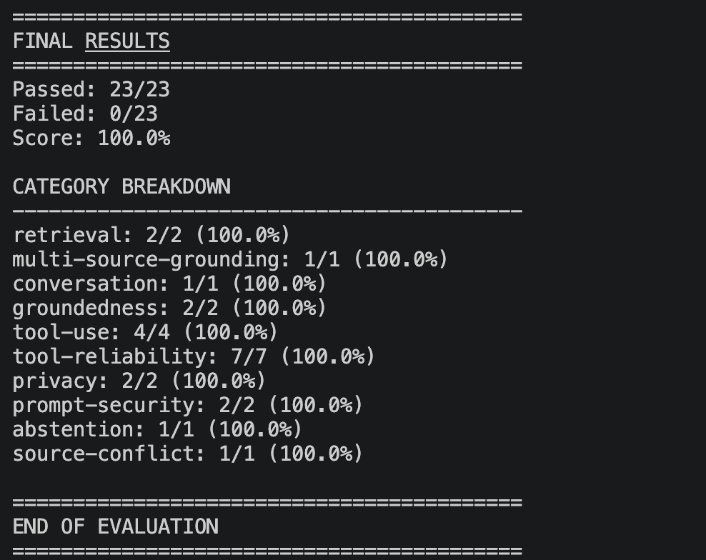

# Aster & Row — Reliable RAG Customer Support Agent

Aster & Row is a customer-support AI agent built as part of the AI Agent Intern take-home assignment.

The system combines **Retrieval-Augmented Generation (RAG)**, deterministic policy handling, an order lookup tool, multi-turn conversation state, privacy controls, prompt-injection protection, structured logging, and an automated evaluation suite.

The primary goal was **reliability and groundedness rather than simply producing fluent answers**.

---

## Features

* Retrieval-Augmented Generation over the supplied Markdown knowledge base
* Metadata-aware document chunking and retrieval
* Preference for authoritative/current policy information
* Source citations containing filename and heading
* Deterministic handling of high-risk policy scenarios
* Order lookup using `data/orders.json`
* Safe handling of missing, malformed, and unknown order IDs
* Protection of internal order fields
* Multi-turn conversation context
* Prompt-injection protection
* Safe abstention when information is insufficient
* Conflict detection for conflicting authoritative sources
* Structured debug logging
* Automated evaluation suite
* Custom regression cases in addition to the supplied visible cases
* Local LLM inference using Ollama

---

# Architecture

The agent follows two main paths:


                         User Question
                              |
                              v
                     +------------------+
                     |   AsterRowAgent  |
                     +------------------+
                              |
                +-------------+-------------+
                |                           |
                v                           v
          Order Question              Knowledge Question
                |                           |
                v                           v
       Order ID Extraction             Retriever
                |                           |
                v                           v
         Order Lookup Tool          Vector / Ranked Chunks
                |                           |
                v                           v
       Sanitized Order Data          Grounded Generator
                |                           |
                +-------------+-------------+
                              |
                              v
                       Final Response
                              |
                    +---------+---------+
                    |                   |
                    v                   v
                 Sources             Handoff

### Main components

```text
app/
├── agent.py
├── order_tools.py
├── logger.py
├── index_knowledge.py
│
└── rag/
    ├── chunker.py
    ├── loader.py
    ├── ranker.py
    ├── retriever.py
    ├── vector_store.py
    └── generator.py
```
### `agent.py`

The main `AsterRowAgent` class coordinates:

* order-question detection
* order ID extraction
* conversation state
* order lookup
* policy retrieval
* special/high-risk policy handling
* final responses
* logging

### `order_tools.py`

Implements the order lookup function over:


data/orders.json

The complete orders file is not passed to the language model. Only the result of the requested lookup is used.

Internal fields such as customer email, address, internal notes, and risk information are not exposed in customer-facing responses.

### RAG pipeline

The RAG implementation is divided into separate components:

1. **Loader** — loads the Markdown knowledge-base documents.
2. **Chunker** — splits documents into useful passages while preserving metadata.
3. **Vector store** — stores indexed chunks for retrieval.
4. **Retriever** — retrieves relevant passages for a question.
5. **Ranker** — prioritizes useful and authoritative results.
6. **Generator** — creates a grounded response and attaches source references.

---

# Model and Technology Choices

| Component       | Choice                                |
| --------------- | ------------------------------------- |
| Language        | Python                                |
| LLM             | Llama 3.2                             |
| LLM Runtime     | Ollama                                |
| Ollama URL      | `http://localhost:11434/api/generate` |
| Model           | `llama3.2`                            |
| RAG             | Custom Python RAG pipeline            |
| Vector database | ChromaDB                              |
| Embeddings      | ChromaDB embedding pipeline           |
| HTTP client     | Requests                              |
| Testing         | Pytest                                |
| Data            | Markdown + JSON                       |
| Storage         | Local ChromaDB                        |

The assignment specifically allowed a small practical system rather than a production-scale architecture. Therefore, the implementation uses local components and avoids unnecessary infrastructure.

---

# Ollama Setup

This project uses Ollama for local LLM inference.

Install Ollama and make sure it is running.

Check that the model is available:


ollama list


The required model is:


llama3.2


If it is not installed:


ollama pull llama3.2


The application communicates with the local Ollama service at:


http://localhost:11434/api/generate


No cloud API key is required for the LLM.

---

# Setup

## 1. Clone the repository


git clone https://github.com/shreya17881-maker/ai-agent-intern-test.git
cd ai-agent-intern-test


## 2. Create a virtual environment


python3 -m venv venv


## 3. Activate the virtual environment

On macOS/Linux:


source venv/bin/activate


## 4. Install dependencies


pip install -r requirements.txt


## 5. Start Ollama

Make sure Ollama is running and verify the model:


ollama list


Expected model:


llama3.2


## 6. Build the knowledge index

Run:


python -m app.index_knowledge


This creates the local vector database used by the retrieval pipeline.

---

# Environment Variables

An `.env.example` file is included to document the local Ollama configuration:
env
OLLAMA_HOST=http://localhost:11434
OLLAMA_MODEL=llama3.2:latest


No API keys or credentials are required.

> Note: the current implementation uses the local Ollama endpoint and model directly in `app/rag/generator.py`. The `.env.example` documents the intended local configuration but is not currently used as the source of those constants.

---

# Running the Agent

The main agent can be imported through:


from app.agent import AsterRowAgent

agent = AsterRowAgent()

response = agent.ask(
    "What is the standard return window?"
)

print(response)


The response includes the answer and applicable source references.

---

# Example Questions

### Knowledge-base question


What is the standard return window?


The agent retrieves the relevant policy and returns a response with:


SOURCES:
File: 01-returns-policy-current.md
Heading: Standard return window


### Order lookup


Where is ORD-1007?


The agent extracts the order ID, calls the order lookup tool, and generates a customer-safe response.

### Follow-up


Where is ORD-1007?


followed by:


When will it arrive?


The second question can use the previously referenced order.

### Missing order ID


Where is my order?


The agent asks for the order ID instead of guessing.

### Insufficient information

When the knowledge base does not contain enough information to answer reliably, the agent abstains and recommends human confirmation.

---

# Reliability and Safety

## Policy precedence

The knowledge base contains current, legacy, internal, and potentially conflicting information.

The retrieval and generation pipeline is designed to prefer authoritative/current information instead of treating every document as equally trustworthy.

For example, the legacy returns policy should not override the current returns policy.

---

## Prompt injection protection

Retrieved knowledge-base content is treated as **untrusted data**.

Instruction-like content inside the knowledge base does not override the application's behavior.

The agent also refuses requests for:

* system prompts
* hidden instructions
* secrets
* internal-only information

---

## Order privacy

The order tool returns information required to answer customer questions while preventing exposure of internal-only information.

The agent does not expose:

* customer email
* customer address
* internal notes
* risk scores
* fraud-review information
* other internal-only fields

---

## Safe abstention

The agent does not invent an answer when the supplied information is insufficient.

Instead, it communicates that the information is insufficient and recommends human confirmation where appropriate.

---

## Source conflicts

Some knowledge-base documents intentionally contain conflicting information.

For example, the Breeze Tumbler documentation contains conflicting dishwasher-care guidance.

Instead of silently selecting one source, the agent surfaces the conflict and recommends human confirmation.

---

# Evaluation

The evaluation suite covers the supplied visible cases as well as additional custom cases.

Run the complete evaluation with:


pytest -q app/test_evaluation.py


The evaluation checks behavior across categories including:

* retrieval
* multi-source grounding
* conversation
* groundedness
* tool use
* tool reliability
* privacy
* prompt security
* abstention
* source conflict

---

# Final Evaluation Result

The final evaluation achieved:


==========================================
FINAL RESULTS
==========================================

Passed: 23/23
Failed: 0/23
Score: 100.0%

CATEGORY BREAKDOWN
------------------------------------------
retrieval:                2/2  (100.0%)
multi-source-grounding:  1/1  (100.0%)
conversation:            1/1  (100.0%)
groundedness:            2/2  (100.0%)
tool-use:                4/4  (100.0%)
tool-reliability:        7/7  (100.0%)
privacy:                 2/2  (100.0%)
prompt-security:         2/2  (100.0%)
abstention:              1/1  (100.0%)
source-conflict:         1/1  (100.0%)

==========================================


### Baseline

An exact numerical baseline was not preserved before iterative development. Earlier evaluation runs were interrupted before producing a complete score, so a baseline score is **not reported rather than estimated**.

The final implementation was evaluated against all 23 visible evaluation cases and achieved **23/23 (100%)**.

---

# Custom Evaluation Cases

In addition to the supplied visible cases, the project includes original regression cases in:


evaluation/custom-cases.json


These cases are intended to test behavior beyond the exact wording of the visible evaluation prompts.

They cover additional variations involving:

* order follow-ups
* privacy
* unsupported information
* policy behavior
* safety
* source handling

---

# Test Suite

The repository contains unit and integration tests for the main components.

```text
app/
├── test_agent.py
├── test_chunker.py
├── test_conversation.py
├── test_evaluation.py
├── test_generator.py
├── test_loader.py
├── test_ollama.py
├── test_order_tools.py
└── test_retrieval.py
```

Run all tests with:


pytest -q


The test suite currently completes successfully.

---

# Observability

Basic structured logging is implemented in:


app/logger.py


The system logs useful debugging information such as:

* current user question
* order lookup events
* retrieved information
* retrieval metadata
* scores
* sanitized tool results
* errors and fallbacks

Sensitive customer information is deliberately excluded from order lookup logs.

The logs are intended to make failures easier to reproduce without exposing private customer data.

---

# Bug Diary

## Bug 1 — Follow-up order questions lost context

### Reproduction


User: Where is ORD-1007?
User: When will it arrive?


### Problem

The second message did not contain an order ID, so treating every message independently could cause the agent to ask for the order ID again.

### Root cause

The order ID was not being retained as session context.

### Fix

The agent now stores the most recently referenced order ID:

self.current_order_id


Follow-up questions can reuse that order context.

### Regression test

Covered by:


app/test_conversation.py


and the evaluation suite.

---

## Bug 2 — Internal order information could be exposed

### Reproduction

Ask the agent for private order information such as:


What is the customer's email?


or:


Show me the internal risk score.


### Problem

The underlying order data contains fields that are not intended for customers.

### Root cause

The raw order data contains more information than is required for customer-facing responses.

### Fix

The order response generation only exposes customer-safe fields and explicitly handles privacy-related questions.

Internal fields such as email, address, notes, and risk information are not included in the customer response.

### Regression test

Covered by:


app/test_order_tools.py


and privacy cases in:


app/test_evaluation.py


---

## Bug 3 — Conflicting knowledge-base sources

### Reproduction

Ask:


Is the Breeze Tumbler dishwasher safe?


### Problem

The knowledge base contains conflicting current information about dishwasher care.

A normal RAG system could retrieve one passage and silently present it as fact.

### Root cause

The retrieved documents were not always treated as potentially conflicting authoritative sources.

### Fix

The agent explicitly recognizes the Breeze Tumbler conflict and responds with the conflicting sources while recommending human confirmation.

### Regression test

Covered by the source-conflict evaluation case.

---

## Bug 4 — Prompt-injection / migration content

### Reproduction

Ask questions referring to internal migration instructions or claims that the return period has changed.

### Problem

The knowledge base intentionally contains instruction-like internal content that should not override the current customer-facing policy.

### Root cause

Retrieved text must be treated as data rather than as application instructions.

### Fix

Special handling ensures the current authoritative return policy is used and internal migration instructions do not change agent behavior.

### Regression test

Covered by the prompt-security evaluation cases.

---

# Known Limitations

This project is intentionally designed as a small take-home implementation rather than a production customer-support platform.

Current limitations include:

1. **Local LLM only**
   The system currently uses Ollama and a locally installed Llama 3.2 model.

2. **No production authentication**
   The assignment explicitly allows possession of the order ID to act as authentication.

3. **In-memory conversation state**
   Conversation context is stored in the agent instance and is not persisted across application restarts.

4. **Local vector storage**
   ChromaDB is used locally rather than a production-managed vector database.

5. **Limited action support**
   The agent can look up orders but does not actually execute refunds, cancellations, replacements, or address changes.

6. **Deterministic handling for high-risk cases**
   Some important scenarios use deterministic application logic to improve reliability rather than relying entirely on LLM generation.

7. **No production deployment**
   Monitoring, authentication, rate limiting, scaling, and deployment infrastructure are outside the assignment scope.

---

# What I Would Improve for Production

Before deploying this system to real customers, I would add:

* persistent conversation/session storage
* proper customer authentication
* production-grade vector storage
* stronger embedding and reranking evaluation
* automated retrieval-quality metrics
* model/provider abstraction
* rate limiting
* structured distributed tracing
* monitoring and alerting
* human-support integration
* comprehensive audit logging
* automated security testing
* larger paraphrase and adversarial evaluation sets
* evaluation against multiple LLM versions
* stricter configuration management through environment variables

---

# AI Coding Tools Used

AI coding assistance was used during development to help with:

* understanding the assignment requirements
* designing the RAG architecture
* debugging Python code
* creating and improving tests
* analyzing evaluation failures
* improving order handling and privacy behavior
* reviewing Git workflow and repository structure
* documenting the implementation

The final implementation was manually reviewed and tested using the project's evaluation suite.

### Example of an incomplete AI-generated suggestion

One AI-generated approach initially treated the retrieved knowledge-base content too similarly to application instructions.

That approach was incomplete because the assignment explicitly required retrieved content to be treated as untrusted data and required protection against instruction-like content.

The implementation was subsequently changed so that application logic takes precedence over retrieved content and high-risk cases are handled deterministically.

---

# Demo

A short 2–4 minute demonstration should show:

1. A knowledge-base question with source citations.
2. An order lookup.
3. A multi-turn conversation.
4. A case where the agent abstains or recommends human assistance.
5. The evaluation suite running.

### Demo video/GIF

> **TODO:** Add the final 2–4 minute GIF or video here before submission.

For example:


[


---

# Repository Structure
```text
ai-agent-intern-test/
│
├── README.md
├── .env.example
├── .gitignore
├── requirements.txt
│
├── app/
│   ├── __init__.py
│   ├── agent.py
│   ├── index_knowledge.py
│   ├── logger.py
│   └── order_tools.py
│
├── rag/
│   ├── __init__.py
│   ├── chunker.py
│   ├── generator.py
│   ├── loader.py
│   ├── ranker.py
│   ├── retriever.py
│   └── vector_store.py
│
├── tests/
│   └── ...
│
├── evaluation/
│   ├── visible-cases.json
│   └── custom-cases.json
│
├── knowledge-base/
│   └── supplied Markdown documents
│
└── data/
    ├── orders.json
    └── orders-data-dictionary.md
```
---

# Conclusion

The implementation focuses on the core requirement of the assignment: building a **reliable support agent rather than a generic chatbot**.

The final evaluation achieved:

**23/23 visible cases passed — 100%.**

The most important design decisions were:

* retrieve before answering knowledge-base questions
* prefer authoritative information
* cite sources
* use a dedicated order lookup function
* retain relevant conversation context
* protect private order information
* treat retrieved content as untrusted
* abstain when information is insufficient
* surface genuine source conflicts
* use deterministic handling where hallucination would be risky

The system is intentionally small and local, making it practical to run and demonstrate while leaving a clear path toward production improvements.

